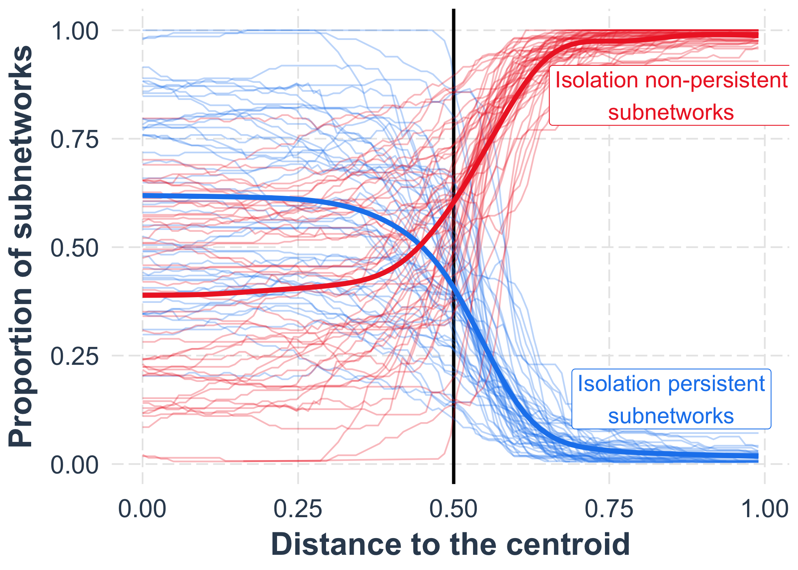

<!-- README.md is generated from README.Rmd. Please edit that file -->

# ReproduceMetaCap

<!-- badges: start -->
<!-- badges: end -->

The goal of this package is to reproduce the paper “Rapid monitoring for
ecological persistence” by Chuliang Song, Benno Simmons, Marie-Josée
Fortin, Andrew Gonzalez, Christopher Kaiser-Bunbury, and Serguei
Saavedra. A preprint of this paper can be found on BiorXiv
([link](https://www.biorxiv.org/content/10.1101/2022.07.02.498308v1)).

## Installation

You can install the development version of ReproduceRapidMonitoring from
[GitHub](https://github.com/) with:

``` r
# install.packages("devtools")
devtools::install_github("clsong/ReproduceRapidMonitoring")
```

## Reproduce

The main figures can be reproduced simply by running
*plot_figure_Number*. For example, figure 3 can be reproduced as

``` r
library(ReproduceRapidMonitoring)
plot_figure_3B()
```


